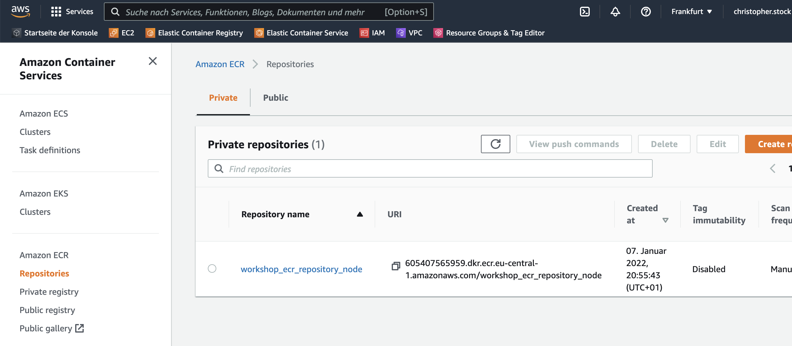
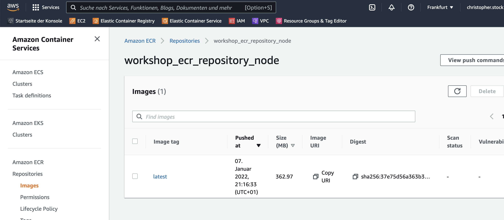
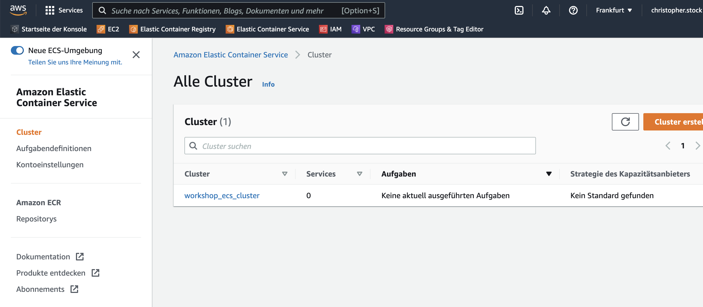
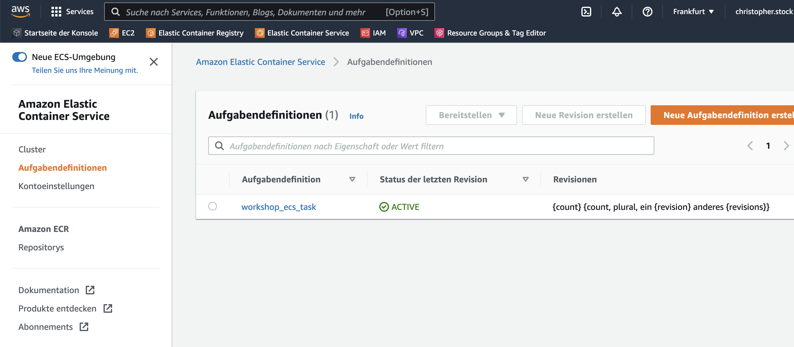
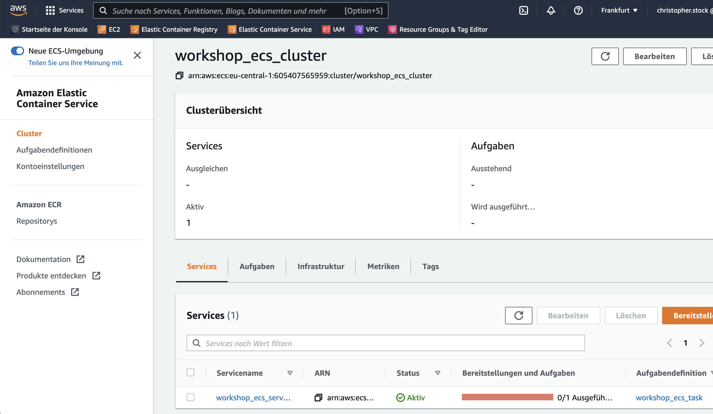
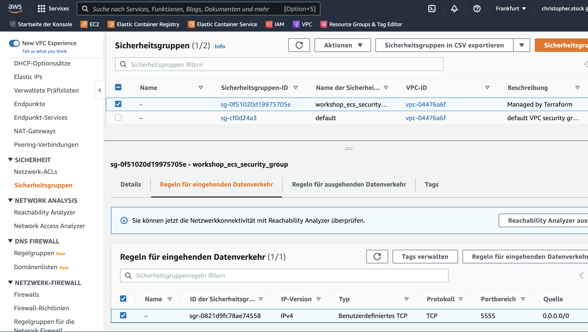
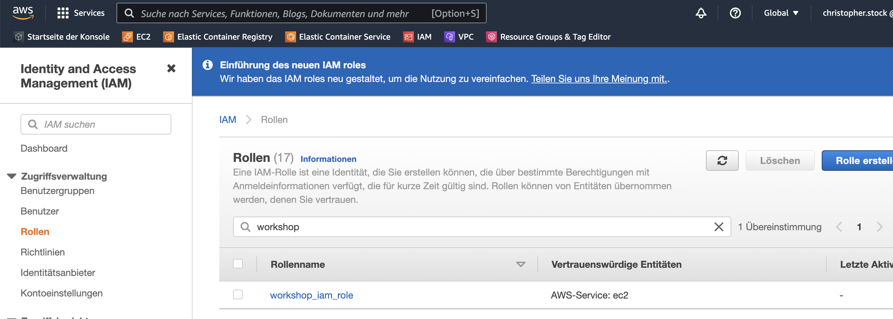
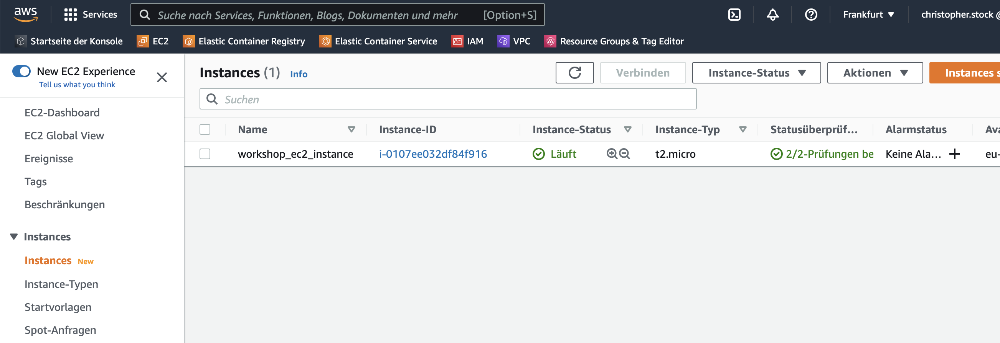

# Terraform AWS Workshop

We'll setup a complete AWS Infrastructure for various Web Applications with Terraform.
It sets up a Terraform configuration for defining one single **AWS EC2 instance**.
This EC2 instance shall run three Docker container using **AWS ECS**.
The containers run on different ports of the EC2 instance and contain various web applications in Node.js,
HTML, JS and PHP.

Als Entwickler möchte ich die Infrastruktur meiner Anwendungen genauso verwalten können wie den Quellcode
 meiner Anwendungen.

# Software Requirements
- Terraform 1.1.3
  `terraform`-cli command
```
  terraform --version
```
- AWS-CLI 2.2.13
  `aws` cli command must be installed
```
  aws --version
```
- AWS Account required (CreditCard required)
  "Die Größe meiner Cloud skaliert mit meiner Kreditkarte"
  Access & Secret Key deployed in `~/.aws/credentials`
```
  aws 
```
- Docker
  `docker info`
  Docker Daemon must be running!

# Quotes
- The set of files used to **describe infrastructure in Terraform** is known as a "**Terraform configuration**". 
- Terraform is an infrastructure as code tool and claims itself as **the swizz army knife for cloud provider management**.

## Optional: IntelliJ AWS Plugin:
https://aws.amazon.com/de/intellij/

# Store AWS Credentials
Enter AWS service "Identity and Access Management (IAM)":
https://console.aws.amazon.com/iamv2/home?#/users
IAM > Users > your user > Sicherheitsanmeldeinformationen
Zugriffsschlüssel erstellen
> Zugriffsschlüssel-ID
> Geheimer Zugriffsschlüssel
In user dir `~/.aws/credentials`.

The AWS-CLI tool provides a **config & credentials wizard** for the 5 primary config fields:
```
aws configure
```

s. AWS Docs:
https://docs.aws.amazon.com/cli/latest/userguide/cli-configure-files.html

## Check AWS credentials
This command will check the calling identity and secret key and report errors if the credentials are not suitable:
```
aws sts get-caller-identity
```

---

# Einführung: Node.js Container Anwendung starten
Dockerfile-Node
```
# base image for this container
FROM node:14

# copy javascript source directory into the container
COPY application/js/* application/js/

# make container's port 8181 accessible to the outside
EXPOSE 8181

# run the app bundle with node
CMD [ "node", "application/js/express-8181.js" ]
```

Applikation:
```
application/js/express-8181.js
```

Das Docker Image kann auch lokal gebaut werden. Daraus kann dann ein Container instanziiert werden.

```
docker build -f 'Dockerfile-Node' --tag express-js-app:14.18 .
docker images
docker run --detach --publish 5555:8181 --tty express-js-app:14.18
http://localhost:5555/user
```
Der interne Container-Port 8181 wird auf das Host-Betriebssystem auf Port 5555 gemappt.

Nachdem der Container gestartet wurde, steht die Node.js express Serveranwendung auf Port 5555 zur Verfügung:
```
http://localhost:5555
http://localhost:5555/user
```

Diese Docker-Container wollen wir nun auf den AWS Server pushen und somit die Node.js express Anwendung auf einer öffentlichen IP verfügbar machen.

---

# Create new Terraform Configuration
Terraform Dateien haben die Erweiterung `.tf`. Beim Ausführen eines Terraform-Befehls werden alle `.tf`-Dateien im aktuellen
  Verzeichnis eingelesen. Somit ist die Anzahl und Benamung aller Terraform-Dateien beliebig.
  Wir erstellen all unsere Terraform-Dateien in einem separaten Unterverzeichnis `terraform` unseres Projekts.
  Daher muss auch der Terraform-Befehl immer aus diesem Verzeichnis heraus aufgerufen werden!
- Terraform's configuration language is **declarative** -
  it describes the desired end-state for your infrastructure and contains NO step-by-step instructions.

---

## 1. terraform/provider.tf - Deklaration des Cloud Providers
Add `terraform/provider.tf`:
```
provider "aws" {
    region = "eu-central-1"
}
```
Download all required Terraform packages for this provider: 
```
terraform init
```
This inits Terraform for the specified setup by downloading all required Terraform plugins --
The plugin ('provider') for AWS and Docker in our case ('kreuzwerker/docker').
Downloads required Terraform AWS plugins.
```
terraform init
```

Terraform creates the lockfile `.terraform.lock.hcl` for tracking changes on the packages required by Terraform.
```
terraform apply
```
Applies the current configuration to the AWS Server.
As no resources has been specified so far, no resources are created.

On changing Terraform configurations, Terraform builds an execution plan that only 
modifies what is necessary to reach the desired state.

---

## 2. terraform/ecr_repository_node.tf - Deklaration eines ECR Repositories für den Node-Docker Container
Mit dem AWS Sercice ECR (Elastic Container Registry) können Docker Container-Images auf den AWS-Server gepusht
  und dort verwaltet werden.
Wir erstellen ein neues aber noch leeres AWS ECR Repository in den später ein Docker-Container gepusht werden kann.
  Wir vergeben die ID und den Namen `workshop_ecr_repository_node` für unser neues Repository.
Add `terraform/ecr_repository_node.tf`:
```
resource "aws_ecr_repository" "workshop_ecr_repository_node" {
    name = "workshop_ecr_repository_node"
}
```
Diese Änderungen wenden wir an. Diesmal müssen wir die skizziert angezeigten Änderungen explizit mit `yes` bestätigen.
```
terraform apply
```
Das neue Container-Repository wird im AWS Service **ECR** unter **Repositories** angezeigt:

Betritt man das Repository, so kann man über den Button **View Push Commands** die erforderlichen CLI-Befehle einsehen,
  um ein Docker Container-Image lokal zu bauen und in dieses AWS ECR Repository zu pushern.

Diese Befehle führen wir jetzt nicht manuell lokal aus sondern verbauen sie in unser Terraform-Skript:
Complete `terraform/ecr_repository_node.tf`.

Da diese `provisioner`-Schritte lediglich bei der Probisionierung, also dem initialen Setup des Repositories ausgeführt werden,
müssen wir die Terraform-Konfiguration explizit zerstören und erneut erstellen. Beide Befehle müssen mit `yes` bestätigt werden:
```
terraform destroy
terraform apply
```
Die Provisionierung dauert nun auch deutlich länger. Anschließend können wir unser neues Node.js-Container-Image
  in unserem Repository sehen:


Unsere Node.js-Anwendung ist damit in einem Container-Image abgelegt und in der ECR registriert.

---

## 3. ECS Service

Mit dem AWS-Service **ECS** (Elastic Container Service) können nun Container von den registrierten Images
  instanziiert und gestartet werden.

The ECS is a fully managed container orchestration service for running containers.

Der ECS besteht aus drei Komponenten: **clusters**, **services**, and **tasks**:
- **Tasks** are JSON files that describe how a container should be run. Beispielsweise werden die Ports und Container Images angegeben. 
- A **service** simply runs a specified number of tasks and restarts/kills them as needed.
- A **cluster** is a logical grouping of **services** and **tasks**.

---

### 3.1. terraform/ecs_cluster.tf - Deklaration eines ECS Clusters
Create full `terraform/ecs_cluster.tf`.

```
terraform apply
```
Unser neu erstellter ECS Cluster wird im ECS Service angezeigt:


---

### 3.2. terraform/ecs_task_definition.tf - Add ECS Task Definition
Create first container task in `terraform/ecs_task_definition.tf`:

```
resource "aws_ecs_task_definition" "workshop_ecs_task" {
    family = "workshop_ecs_task"
    container_definitions = <<EOF
    [
        {
            "name": "node",
            "cpu": 128,
            "memory": 128,
            "image": "${aws_ecr_repository.workshop_ecr_repository_node.repository_url}",
            "essential": true,
            "portMappings": [
                {
                    "hostPort": 5555,
                    "protocol": "tcp",
                    "containerPort": 8181
                }
            ]
        }
    ]
    EOF
}
```
Angegeben wird die CPU u. RAM usage, das container image sowie das Port mapping.
Der Host-Port 5555 wird also umgemappt auf den Container-Port 8181 -- 
genau wie in unserem lokal durchgeführten Docker-Container-Beispiel.
```
terraform apply
```

Danach wird unsere neue Task-Definition im ECS unter **Aufgabendefinitionen** angezeigt:


---

### 3.3. terraform/ecs_service.tf - Add ECS Service
Nun erstellen wir den ECS Service und geben für den Service die zuletzt deklarierten ECS-Cluster und die
  deklarierte ECS-Taskdefinition an.
Add full `terraform/ecs_service.tf`.
```
terraform apply
```

Danach wurde der ECS Service erstellt und in unserem Workshop-Cluster `workshop_ecs_cluster` angelegt.
  Er kann hier in der Web-Oberfläche eingesehen werden:


---

## 4. terraform/ecs_security_group.tf - Add Network Security Group
Allow incoming port 5555 on the host machine and propagation to port 5555 in our ECS service.
```
resource "aws_security_group" "workshop_ecs_security_group" {
    name = "workshop_ecs_security_group"

    ingress {
        from_port   = 5555 # allow traffic in from port 5555
        to_port     = 5555
        protocol    = "tcp" # allow ingoing tcp protocol
        cidr_blocks = ["0.0.0.0/0"] # allow traffic in from all sources
    }

    egress {
        from_port   = 0 # allow traffic out on all ports
        to_port     = 0
        protocol    = "-1" # allow any outgoing protocol
        cidr_blocks = ["0.0.0.0/0"] # allow traffic out from all sources
    }
}
```
Nach dem Durchführen von
```
terraform apply
```
ist die neue Sicherheitsgruppe erstellt.
Diese wird im AWS Service VPC (Virtual Private Cloud) erstellt:
VPC > Sicherheit > Sicherheitsgruppen


---

## 5. IAM instance profile + IAM role
Im Service AWS IAM (Identity and Access Management) muss ein Profil für unsere EC2-Instanz erstellt werden.
Hierfür muss auch eine IAM Role erstellt werden. 
Add files `terraform/iam_instance_profile.tf` and `terraform/iam_role.tf`.
```
terraform apply
```
Anschließend wird das neue IAM Instance Profile und die neue IAM Role in der Weboberfläche angezeigt:


Das **Instance-Profile** kann nicht über die Web-Oberfläche verwaltet werden sondern lediglich über Terraform bzw. über den AWS CLI-Client.

---

## 6. terraform/ec2_instance.tf - Add EC2 Instance
Nun haben wir alle Services beisammen die wir zum Betrieb unseres Containers benötigen.
Da diese auch eine Maschine/Serverinstanz benötigen, erstellen wir als letztes eine EC2 Instanz
mit Hilfe des AWS Services **EC2** (Elastic Compute Cloud).

Alle zur Verfügung stehenden EC2 Instanztypen (AMI = Amazon Machine Image) finden Sie unter
`EC2 > Abbilder > AMI Catalog`.

The next Terraform file will describe our **AWS EC2** instance:
```
terraform/ec2_instance.tf
```
Das Feld `user_data` definiert ein Shell-Skript, das beim Startend der Maschine ausgeführt wird.
Hier ist es erforderlich, den Namen unseres ECS-Clusters in die ECS-Configdatei `/etc/ecs/ecs.config` zu schreiben.
```
terraform apply
```
Unsere neue EC2-Instanz wird anschließend im AWS EC2 service angezeigt:


Die `public IP` der EC2-Instanz kann hier ausgelesen werden.
  Mit einem cURL können wir nun die Node.js-Express-Anwendung in unserem Container erreichen:
```
curl -v http://13.40.148.82:5555/user
```
Ausgabe:
```
*   Trying 3.70.224.181:5555...
* Connected to 3.70.224.181 (3.70.224.181) port 5555 (#0)
> GET /user HTTP/1.1
> Host: 3.70.224.181:5555
> User-Agent: curl/7.77.0
> Accept: */*
> 
* Mark bundle as not supporting multiuse
< HTTP/1.1 200 OK
< X-Powered-By: Express
< Content-Type: application/json; charset=utf-8
< Content-Length: 135
< ETag: W/"87-gHZz+1+n7pHvd2ovXSzGNYJ6RNM"
< Date: Sat, 08 Jan 2022 11:17:44 GMT
< Connection: keep-alive
< Keep-Alive: timeout=5
< 
* Connection #0 to host 3.70.224.181 left intact
[{"name":"John Smith","username":"jsmith"},{"name":"Jane Williams","username":"jwilliams"},{"name":"Robert Brown","username":"rbrown"}]%      
```

---

## 7. terraform/output.tf - Output Queries Values from AWS
Mit dem `output` Schlüsselwort können nach Abschluß des Deploy-Vorgangs
  Werte ausgegeben werden. Dies bietet sich an, um die erstellt public IP-Adresse auszugeben.

Wir erstellen die Datei `outputs.tf` und wenden diese Erweiterung in unserer Konfiguration an:
```
terraform apply
```
Hier können wir uns direkt die vergebene public-IP anzeigen lassen und auch direkt
  das cURL-Testkommando ausgeben.
```
API_HOST = "http://3.70.224.181"
CURL_TEST_COMMAND_NODE = "curl -v 'http://3.70.224.181:5555/user'"
...
```
Das `terraform output` Kommando kann auch unabhängig ausgeführt werden und gibt alle definierten
  Ausgabe-Variablen aus:
```
terraform output
``` 
Terraform outputs help to connect Terraform projects with other parts of your infrastructure,
or with other Terraform projects.

---

## 8. Second Container: nginx

### 8.1. nginx Dockerfile
Add `Dockerfile-nginx`.
Die Anweisung ADD im Dockerfile beinhaltet eine Magic, mit der eine Archivdatei direkt an den Zielort extrahiert wird. 

### 8.2. nginx default configuration
Add `default`:
```
server {
    listen 80 default_server;

    root /var/www/html;

    index index.html index.htm;

    server_name _;

    charset utf-8;

    location = /favicon.ico { log_not_found off; access_log off; }
    location = /robots.txt  { log_not_found off; access_log off; }
}
```

### 8.3. new ECR Repository for nginx container
Add `terraform/ecs_repository_nginx`.
Der `docker login` Befehl muss hier nicht erneut definiert werden,
  da er bereits im ECR-Node-Repository ausgeführt wird. Einmaliges Ausführen genügt.

### 8.4. new Task definition
Erweitern `terraform/ecs_task_definition.tf`.
Hier wird der zweite Container hinzugefügt und hierfür dessen Image und Port Mapping deklariert:
```
resource "aws_ecs_task_definition" "workshop_ecs_task" {
    family = "workshop_ecs_task"
    container_definitions = <<EOF
    [
        {
            "name": "node",
            "cpu": 128,
            "memory": 128,
            "image": "${aws_ecr_repository.workshop_ecr_repository_node.repository_url}",
            "essential": true,
            "portMappings": [
                {
                    "hostPort": 5555,
                    "protocol": "tcp",
                    "containerPort": 8181
                }
            ]
        },
        {
            "name": "nginx",
            "cpu": 128,
            "memory": 128,
            "image": "${aws_ecr_repository.workshop_ecr_repository_nginx.repository_url}",
            "essential": true,
            "portMappings": [
                {
                    "hostPort": 5556,
                    "protocol": "tcp",
                    "containerPort": 80
                }
            ]
        }
    ]
    EOF
}
```

### 8.5. Öffnen des Ports 5556 für eingehende Requests
Hierfür muss die `terraform/ecs_security_group.tf` erweitert werden und eingehender Verkehr auf dem Port 5556 explizit erlaubt werden:
```
resource "aws_security_group" "workshop_ecs_security_group" {
    name = "workshop_ecs_security_group"

    ingress {
        from_port   = 5555 # allow traffic in from port 5555
        to_port     = 5555
        protocol    = "tcp" # allow ingoing tcp protocol
        cidr_blocks = ["0.0.0.0/0"] # allow traffic in from all sources
    }

    ingress {
        from_port   = 5556 # allow traffic in from port 5556
        to_port     = 5556
        protocol    = "tcp" # allow ingoing tcp protocol
        cidr_blocks = ["0.0.0.0/0"] # allow traffic in from all sources
    }

    egress {
        from_port   = 0 # allow traffic out on all ports
        to_port     = 0
        protocol    = "-1" # allow any outgoing protocol
        cidr_blocks = ["0.0.0.0/0"] # allow traffic out from all sources
    }
}
```

### 8.6. Erweitern der Ausgabevariablen
Die Repository-URL des nginx-Docker-Images können wir und ebenso wie der CURL-Befehl zum Requesten der nginx-Applikation
  zu unseren Ausgabevariablen hinzufügen:
```
output "API_HOST" {
    value = "http://${aws_instance.workshop_ec2_instance.public_ip}"
}

output "CURL_TEST_COMMAND_NODE" {
    value = "curl -v 'http://${aws_instance.workshop_ec2_instance.public_ip}:5555/user'"
}
output "CURL_TEST_COMMAND_NGINX" {
    value = "curl -v 'http://${aws_instance.workshop_ec2_instance.public_ip}:5556'"
}

output "PUBLIC_DNS" {
    value = "https://${aws_instance.workshop_ec2_instance.public_dns}"
}

output "URL_ECS_REPOSITORY_NODE" {
    value = "${aws_ecr_repository.workshop_ecr_repository_node.repository_url}"
}
output "URL_ECS_REPOSITORY_NGINX" {
    value = "${aws_ecr_repository.workshop_ecr_repository_nginx.repository_url}"
}
```

Wenden wir nun die neue Konfiguration an
```
terraform apply
```
so läuft auch unser zweiter Container und kann via cURL erreicht werden.
```
curl -v '3.70.224.181:5556'
``` 
Da es sich um eine HTML-Webapplikation bzw. ein Browserspiel handelt, kann die Webseite auch im Browser geöffnet werden:
```
http://3.70.224.181:5556
```

---

## 9. Third Container: php-fpm

### 9.1. PHP Dockerfile
Add `Dockerfile-PHP`.

### 9.2. nginx Dockerfile
Ausliefern der PHP Laravel App `application/php/laravel-app.tar.gz`.
Revise `Dockerfile-nginx`

### 9.3. nginx default configuration
Erweitern für Support des PHP Präprozessors:
`default`:
```
server {
    listen 80 default_server;

    root /var/www/html/public;

    index index.html index.htm index.php;

    server_name _;

    charset utf-8;

    location = /favicon.ico { log_not_found off; access_log off; }
    location = /robots.txt  { log_not_found off; access_log off; }

    location / {
        try_files $uri $uri/ /index.php$is_args$args;
    }

    location ~ \.php$ {
        include snippets/fastcgi-php.conf;
        fastcgi_pass php:5556;
    }

    error_page 404 /index.php;

    location ~ /\.ht {
        deny all;
    }
}
```

### 9.4. php-fpm configs
Damit der php-fpm funktioniert, werden im Dockerfile noch die beiden Konfigurationsdateien
  `php-fpm.conf` sowie `www.conf` deployed. Diese müssen dem Rootverzeichnis unseres Workshop-Projekts hinzugefügt werden.

### 9.5. new ECR Repository for php-fpm container
Add `terraform/ecs_repository_php`.

### 9.6. Erweitern der Task definition
Erweitern `terraform/ecs_task_definition.tf`.
Es wird nun der dritte Container für den php-fpm hinzugefügt. Dieser erhält
  kein Port-Mapping sondern wird mithilfe der Angabe im Feld `links` auf den nginx-Container aufgeschaltet.
```
resource "aws_ecs_task_definition" "workshop_ecs_task" {
    family = "workshop_ecs_task"
    container_definitions = <<EOF
    [
        {
            "name": "node",
            "cpu": 128,
            "memory": 128,
            "image": "${aws_ecr_repository.workshop_ecr_repository_node.repository_url}",
            "essential": true,
            "portMappings": [
                {
                    "hostPort": 5555,
                    "protocol": "tcp",
                    "containerPort": 8181
                }
            ]
        },
        {
            "name": "nginx",
            "cpu": 128,
            "memory": 128,
            "image": "${aws_ecr_repository.workshop_ecr_repository_nginx.repository_url}",
            "essential": true,
            "links": [
                "php:php"
            ],
            "portMappings": [
                {
                    "hostPort": 5556,
                    "protocol": "tcp",
                    "containerPort": 80
                }
            ]
        },
        {
            "name": "php",
            "cpu": 128,
            "memory": 128,
            "image": "${aws_ecr_repository.workshop_ecr_repository_php.repository_url}",
            "essential": true
        }
    ]
    EOF
}
```

### 9.7. Erweitern der Ausgabevariablen
Auch die Repository-URL des php-fpm-Docker-Images können wir und ebenso wie der CURL-Befehl zum Requesten der PHP Laravel-Applikation
  zu unseren Ausgabevariablen hinzufügen:
```
output "API_HOST" {
    value = "http://${aws_instance.workshop_ec2_instance.public_ip}"
}

output "CURL_TEST_COMMAND_NODE" {
    value = "curl -v 'http://${aws_instance.workshop_ec2_instance.public_ip}:5555/user'"
}
output "CURL_TEST_COMMAND_PHP" {
    value = "curl -v --header 'Accept: application/json' 'http://${aws_instance.workshop_ec2_instance.public_ip}:5556/api/v1/countries?name=Spain'"
}

output "PUBLIC_DNS" {
    value = "https://${aws_instance.workshop_ec2_instance.public_dns}"
}

output "URL_ECS_REPOSITORY_NODE" {
    value = "${aws_ecr_repository.workshop_ecr_repository_node.repository_url}"
}
output "URL_ECS_REPOSITORY_NGINX" {
    value = "${aws_ecr_repository.workshop_ecr_repository_nginx.repository_url}"
}
output "URL_REPOSITORY_PHP" {
    value = "${aws_ecr_repository.workshop_ecr_repository_php.repository_url}"
}
```

Da sich der Inhalt unseres nginx-Containers nun geändert haben, zerstören wir nun explizit die Terraform Konfiguration:
```
terraform destroy
```

Wenden wir die geänderte Konfiguration anschließend an:
```
terraform apply
```
so können wir einen CURL auf die PHP-Laravel-Applikation durchführen.
Diese Anwendung liefert uns den Country-Code für das angegebene Land.
Unterstützt werden als Eingabewerte die Länder `Spain` und `UK`.
```
curl -v --header 'Accept: application/json' 'http://3.124.209.246:5556/api/v1/countries?name=UK'
```
Ausgabe:
```
*   Trying 3.124.209.246:5556...
* Connected to 3.124.209.246 (3.124.209.246) port 5556 (#0)
> GET /api/v1/countries?name=UK HTTP/1.1
> Host: 3.124.209.246:5556
> User-Agent: curl/7.77.0
> Accept: application/json
> 
* Mark bundle as not supporting multiuse
< HTTP/1.1 200 OK
< Server: nginx/1.10.3 (Ubuntu)
< Content-Type: application/json
< Transfer-Encoding: chunked
< Connection: keep-alive
< Cache-Control: no-cache, private
< Date: Sat, 08 Jan 2022 14:10:18 GMT
< 
* Connection #0 to host 3.124.209.246 left intact
{"ISO":"GB"}%
```

---

# More Terraform Commands and Features

## Auto-Format all Terraform files
```
terraform fmt
```

## Show Configuration change plan without apply (dry run)
```
terraform plan
```

## Validate current Terraform Configuration
```
terraform validate
```

## Show current Terraform State Configuration
```
terraform show
```

## List all Resources in your project's state:
```
terraform state list
```

## Input Variables
New file `variables.tf` added.

All `.tf` files are loaded by Terraform -- Naming is arbitrary.

We'll extract the region `eu-central-1` to one distinct place now and replace it in all occuring files:

..

### Passing Variables via CLI
This overrides the file values.
```
terraform apply -var "instance_name=YetAnotherName"
```

## Local state file
Terraform is working with a local statefile.
`terraform.tfstate`
=> Da ja auch über die (AWS-)Web-Oberfläche Werte geändert werden können.

- Terraform keeps track of your real infrastructure in a **state file**,
  which acts as a **source of truth** for your environment.

- Terraform uses the state file to determine the changes to make to your infrastructure
  so that it will match your configuration.

## Terraform Import
Terraform kann auch die aktuelle Config aus der AWS Web-Oberfläche auslesen und in einer lokalen Terraform-Konfiguration ablegen.
```
testcode?
```

# Terraform rocks!

## Quotes
"Infrastructure as Code" is just right for developers:
  Infrastruktur ist genauso ein Artefakt wie der Quellcode meiner Anwendung
Terraform has a good developer experience.

- IaC tools allow you to manage infrastructure with configuration files rather than through a graphical UI
- "Die Größe meiner Cloud skaliert mit der Kreditkarte."
- "Terraform ist das Schweizer Taschenmesser der Cloud Infrastruktur"
- Terraform can be used with all major cloud providers.
  (AWS, Microsoft Azure, Google Cloud. Kubernetes, Oracle Cloud Infrastructure)
